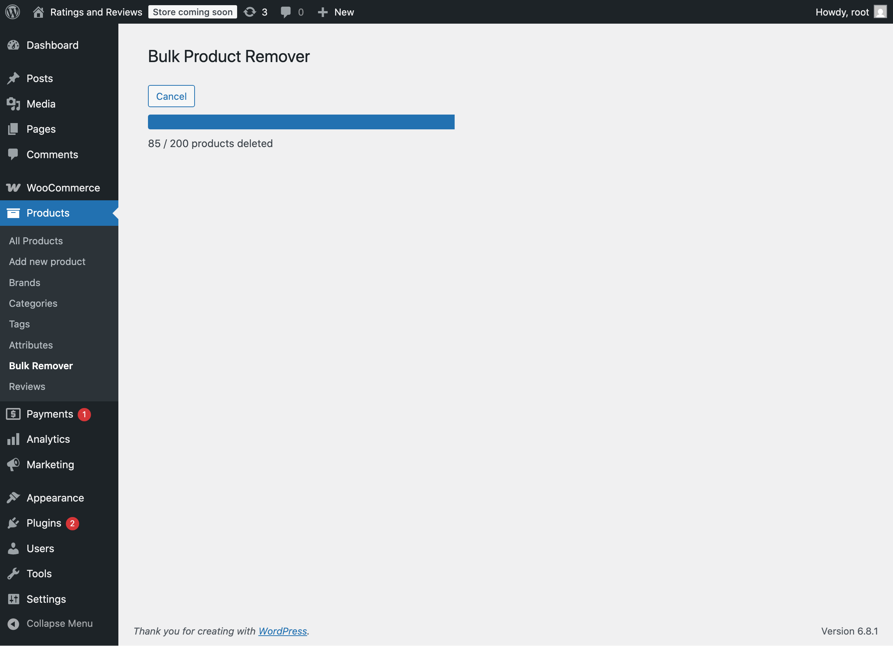

# Bulk Product Remover

**Contributors:** kamal15  
**Tags:** woocommerce, bulk-delete, products, admin tools, csv  
**Requires at least:** 5.0  
**Tested up to:** 6.8  
**Requires PHP:** 7.2  
**Stable tag:** 1.0.0  
**License:** GPLv2 or later  
**License URI:** [https://www.gnu.org/licenses/gpl-2.0.html](https://www.gnu.org/licenses/gpl-2.0.html)

---

## Description

**Bulk Product Remover** is a powerful, user-friendly WordPress plugin that allows you to efficiently delete multiple WooCommerce products simultaneously by uploading a simple CSV file. Save time managing large catalogs with a quick and secure bulk deletion process.

---

## Installation

1. Upload the `bulk-product-remover` folder to your `/wp-content/plugins/` directory **OR** install the plugin via the WordPress plugin directory.  
2. Activate the plugin via the **Plugins** menu in WordPress.  
3. Navigate to **Products** > **Bulk Remover** in the WordPress admin menu.  
4. Upload your CSV file containing product IDs and click **Delete Products**.

---

## How to Use

1. Prepare a CSV file with product IDs in the first column (header can be `id`).  
2. Go to **Products > Bulk Remover** in your admin dashboard.  
3. Upload your CSV file using the provided file input.  
4. Click **Delete Products** to start the deletion.  
5. Monitor the progress bar for real-time status.  
6. Download the report after completion.

> **Note:** Product IDs must exactly match existing products to be deleted. Otherwise, the CSV will not remove those entries.

---

## Features

- ✅ CSV file upload for bulk product deletion  
- ✅ Real-time progress bar to track deletion  
- ✅ Download detailed deletion reports  
- ✅ Secure operations with nonce verification & file validation  
- ✅ Access restricted to WooCommerce management users  
- ✅ Robust error handling for uploads & deletion  
- ✅ Multilingual ready  

---

## Screenshots

|  |  |
| :---: | :---: |
| Start deleting products | Deletion completed |

---

## Frequently Asked Questions

**Q:** What format should my CSV file be in?  
**A:** CSV must have product IDs in the first column, optionally with the first row as `id`.

**Q:** Is there a limit on how many products I can delete?  
**A:** Batch size of 100-200 recommended for best performance.

**Q:** What if some product IDs don't exist?  
**A:** Non-existent IDs will be skipped automatically.

**Q:** Can I get a report of deleted products?  
**A:** Yes, after deletion, download a CSV report with product details.

**Q:** Is this plugin secure?  
**A:** Absolutely! It includes nonce checks, file validation, capability checks, and input sanitization.

---

## Changelog

### 1.0.0
- Initial release  
- CSV upload for product deletion  
- Progress tracking  
- Deletion reports  
- Security features  

---

## License

Released under the [GPL-2.0 License](https://www.gnu.org/licenses/gpl-2.0.html). You are free to modify and redistribute it under these terms.

---

## Contact

For support or inquiries, email: [virdikamal909@gmail.com](mailto:virdikamal909@gmail.com)

